# LogicApp-knowledge

## LogicAppsとは
システムの開発をローコード/ノーコード開発できるサービスのこと。

プロジェクトで実際にふれてみましたが、広く浅く、何でもできるサービスに感じたので、いろいろやってみます。

まず、LogicAppsで開発する際に、決めなければならない要素があります。それが「トリガー」と言われるアクションになります。

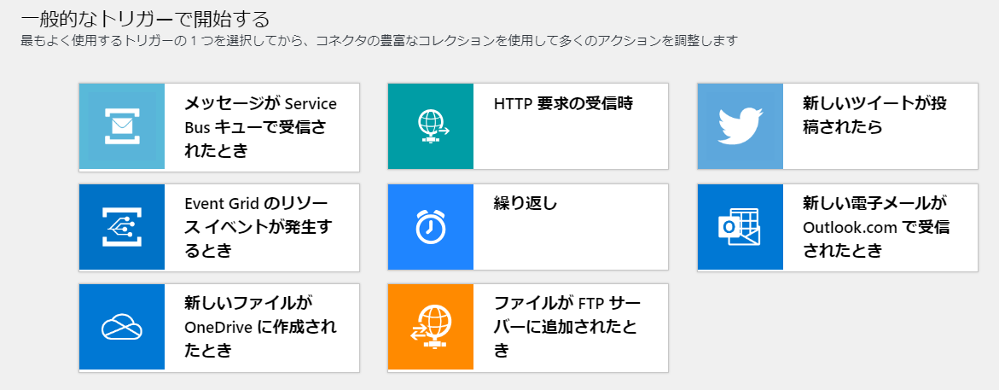

トリガーというのは、LogicAppsが何をきっかけに処理を開始するか。それを示すアクションになります。

簡単な例で説明すると、

「**新しいツイートが投稿されたら**」

↓

「ツイート内容をメールでお知らせする」

この例での「**新しいツイートが投稿されたら**」という部分が「トリガー」に該当します。

LogicAppsが色々できそうだと話した理由の一つが、このトリガーの種類が豊富な点にあります。（上記の画像はほんの一部のトリガーです。）

次に、トリガーの動作によってLogicAppsが呼ばれた後に行うアクションを一部紹介します。

先程の例でいうところの、「**ツイート内容をメールでお知らせする**」にあたる部分の設定になります。


Outlookを使用したアクション以外にも、HTTP応答や、AzureFunctionの実行など、こちらも種類豊富に存在しているため、LogicAppsはかなり何でもできそうです。（2回目）

## リソース作成
今回作成するシステムは、「**HTTPリクエスト受信時にTwitterでツイートを行う**」というものを作ってみます。

まずはトリガーから。要求を選びます。

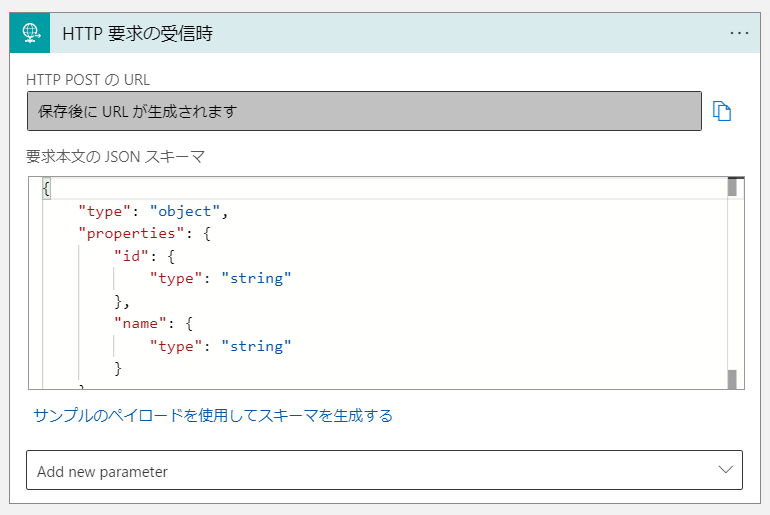

ペイロードは適当に作成。サンプルのペイロードがあれば、それを貼り付けるだけで完了です。

これで、トリガーの設定が完了しました。

次はツイートするためのアクションを設定します。
「新しいステップ」を選択して、「Twitter」を選択。
すると以下のようにTwitterで実行できるアクションの一覧が沢山出てきます。


Twitterひとつとってもこれだけ沢山用意されています。

今回は「**ツイートの投稿**」を選択。

選択すると以下の画面が表示されます。

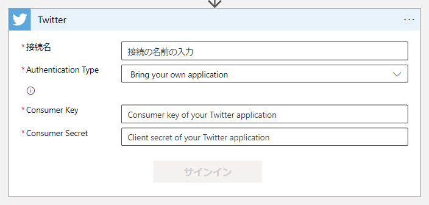

こちらにAPIKey APITokenを入力してサインインを選択。

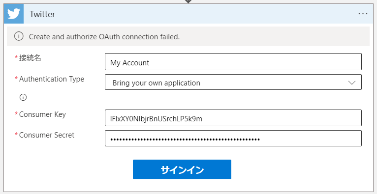

OAuthがどうのこうので接続失敗...

なかなか解決できなさそうだったので一旦パスしようと思います。

ここでの対応としては、「実行が失敗した場合の分岐処理を作成」とします。

例えば以下のようなフローがあったとします。

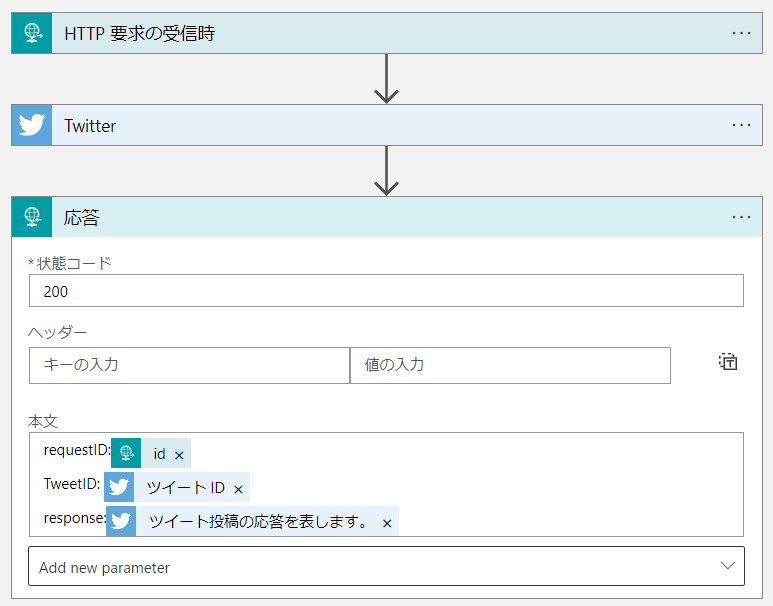

このままでは「Twitter」のブロックで失敗してしまうため、「応答」のアクションには辿り着くことができません。
なので、まずは、分岐処理を作成するところから始めます。

分岐処理の作成はここから行えます。


以下のように応答内容を設定しました。エラーメッセージは先程のOAuthの内容を入れてみました。


これで、分岐処理の作成自体は完成ですが、このままでは、「Twitter」のブロックで失敗した際にそのままLogicAppsが終了してしまいます。

その原因は「**実行構成**」にあります。

2つの応答ブロックをそれぞれ確認すると、以下のように記載されています。

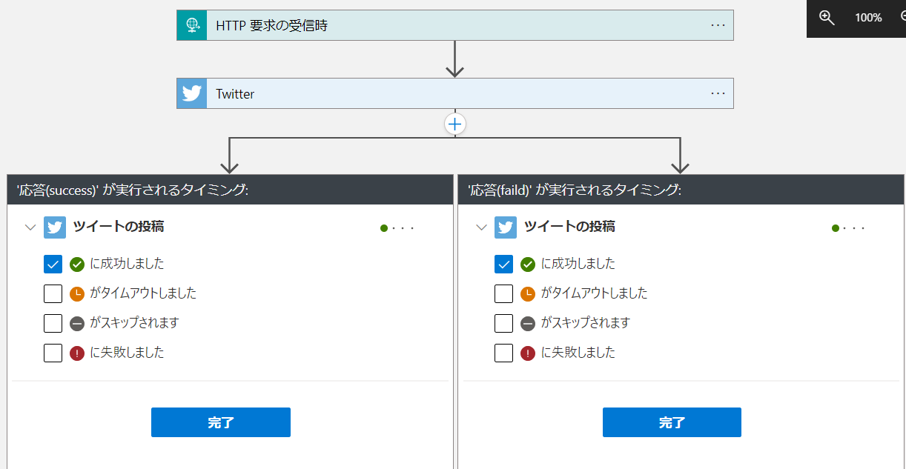

デフォルトの設定では、一つ上のアクションである「Twitter」の処理が成功したときのみ、次の処理が行われるよう設定されています。

なので、今回は、「Twitter」のブロックが失敗したときに、応答(failed)の処理ブロックが行われるように設定します。

これで一通りのリソースの作成は完了です。

次のセクションで、作成したLogicAppsの実行を行ってみます。

## LogicAppsの実行

LogicAppsの実行方法はトリガーによりますが、今回はHTTPリクエストによって発火されるので、実際にリクエストを投げて検証してみます。

宛先のURLは作成後のデザイナーから確認できます。

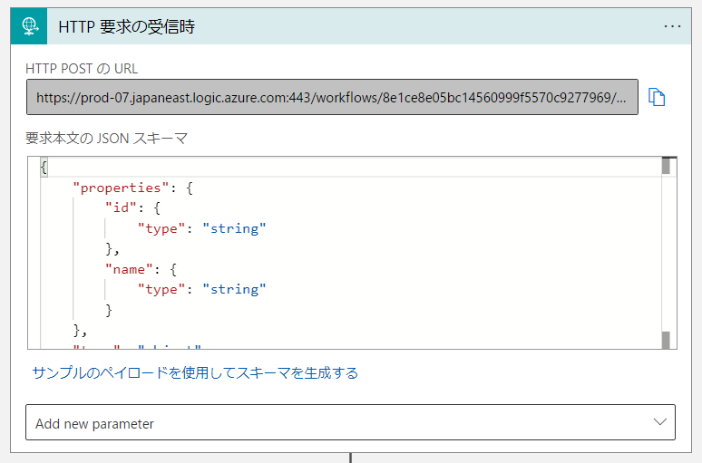

この宛先に対して、後はリクエストを投げれば、LogicAppsが動作してくれます！


ちゃんと期待した通り、400エラーが出ていることがわかると思います。

Azure Portal内からも、詳細な実行結果を「実行の履歴」から参照できます。

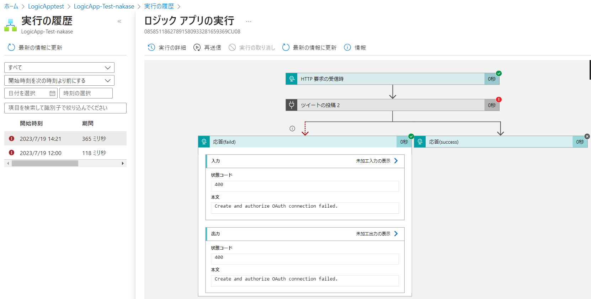

ちゃんと分岐で応答(failed)のブロックに進んでくれています。


## その他機能の復習
LogicAppsには上記で解説したもの以外にもいくつか機能が備わっており、これらを使うことでかなり幅の広がるコーディングを行うことができます。

1. **静的テスト**

一つ目の機能は「静的テスト」です。簡単に言うとLogicApps上でアクションに対してスタブを用意することができます。


各アクションの三点バー内の「テスト（プレビュー）」から設定可能です。


内容は以下の様に設定でき、製作者の都合のいいように記述することが可能です。
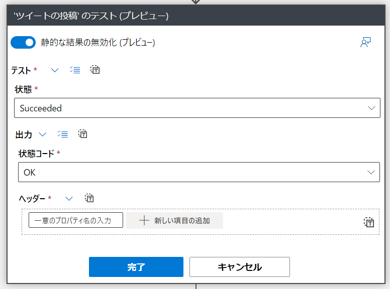

2. **昇格(promote)**

二つ目の機能は「昇格(promote)」です。これはLogicAppsのバージョン管理をしてくれるものになります。Gitの様に多彩な機能が使用できるわけではありません。が、これまでの保存の履歴から、上書きが可能となっています。この機能はとても便利でよく活用しています。

以下の「バージョン」から履歴を確認でき、「昇格」からLogicAppsを上書きできます。

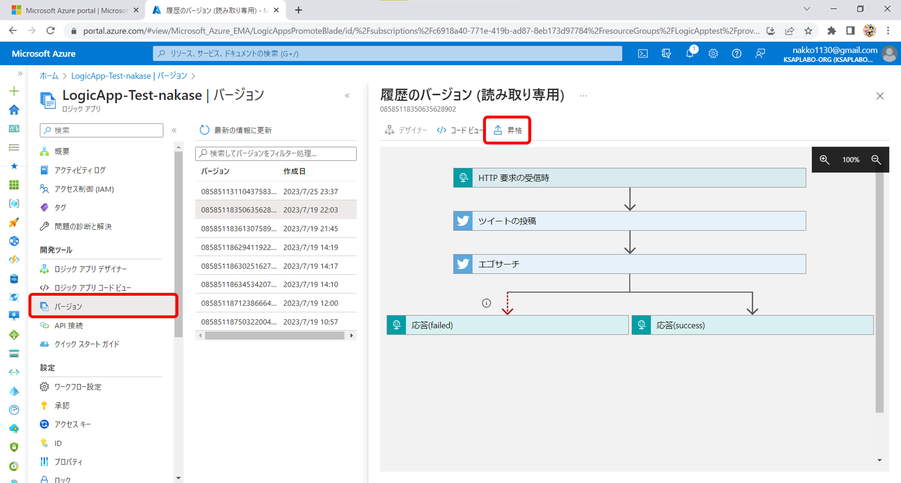

3. **関数機能**

3つ目の機能は「関数機能」です。

下記の画像のような「動的なコンテンツ」が使用できることはすでに説明済みですが、これらに加えて、式を使用することもできます。

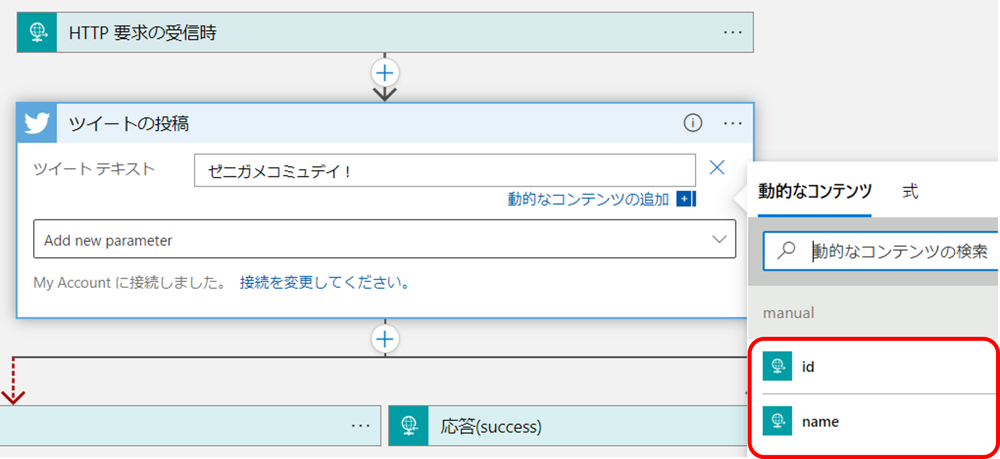


使用感としてはExcelの関数のように使えます。以下の画像はconcat関数を使用して文字列連結を行っています。動的なコンテンツを使用することももちろん可能です。


## おまけ
「LogicAppsの実行」でうまくいかなかったTwitterへの**接続**が成功したので以下に記載します。

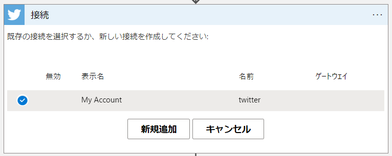

といってもTwitterのアカウントをDeveloper Portalで登録してAPI Keyを作成しただけなので、参考サイトのみの記載とします。[（参考資料）](https://level69.net/archives/33833)

補足すると、Callback URI、Redirect URLを正しく設定する必要があったみたいです。

せっかく接続ができたので、一度走らせてみることにしました。内容は以下の様にツイートをするだけの簡単なものです。

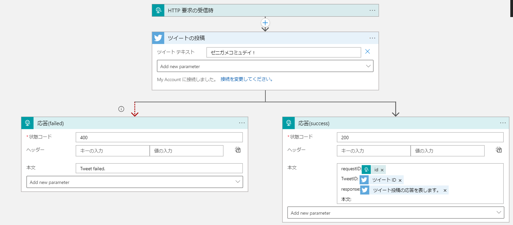

結果から言ってしまうとこのLogicAppsは失敗してしまいました。
エラーメッセージは以下の通りです。
```
{
  "status": 403,
  "message": "You currently have access to a subset of Twitter API v2 endpoints and limited v1.1 endpoints (e.g. media post, oauth) only. If you need access to this endpoint, you may need a different access level. You can learn more here: https://developer.twitter.com/en/portal/product\r\nclientRequestId: a00925af-913e-43b3-a5ac-def9e1b2371f\r\nserviceRequestId: a7acb9c76617c2d212964abc5b85da94f87dff7e5ad4e765e34776ed13ca151b",
  "error": {
    "message": "You currently have access to a subset of Twitter API v2 endpoints and limited v1.1 endpoints (e.g. media post, oauth) only. If you need access to this endpoint, you may need a different access level. You can learn more here: https://developer.twitter.com/en/portal/product"
  },
  "source": "twitter-je.azconn-je-002.p.azurewebsites.net"
}
```


APIのv1.1ではなくv2を使えと言われているように見えますが、これはLogicAppsが「ツイートの投稿」というアクションをv1.1のエンドポイントに対して実行しているという意味なんでしょうか...

6月末頃にエンドポイントを変更するよう指示する記事がかなりヒットしていたため、恐らくそういうことなんだと思います。これ以上調査すると脱線しすぎてしまうので、この調査はここまでとします。（公式ドキュメントにもv1.1,v2の旨の記載なし）

